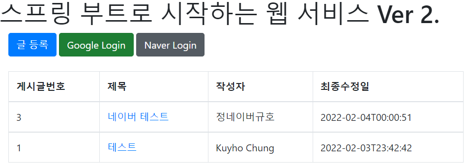
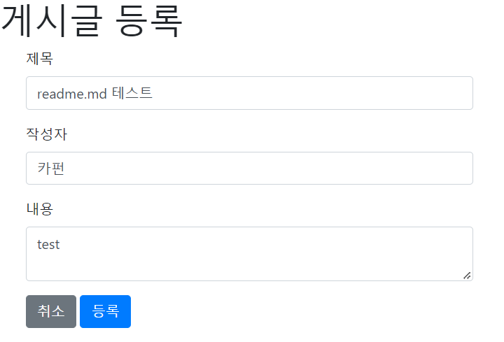
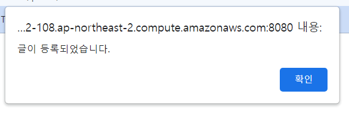
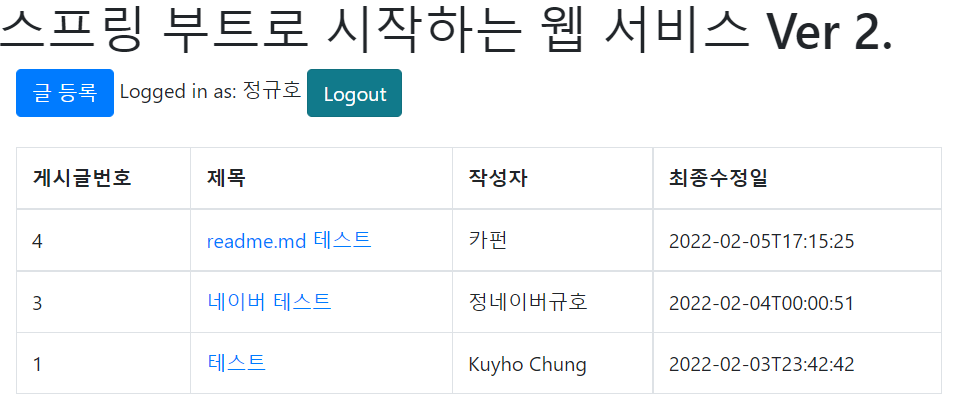
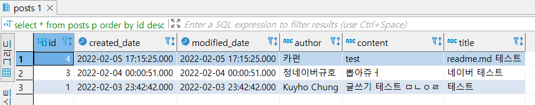

# SpringBoot Web Practise

'스프링 부트와 AWS로 혼자 구현하는 웹 서비스' (이동욱 저) 를 따라하며 Spring Boot의 기본과 AWS 배포에 대해 공부하는 과정을 담은 repository입니다.  
https://katfun.tistory.com/tag/springboot 에서 제 진행 과정을 확인하실 수 있습니다.  

## 실제 배포한 결과물
http://ec2-3-37-102-108.ap-northeast-2.compute.amazonaws.com:8080/

### step 1
8장까지 진행한 결과물입니다.
  

  
구글 / 네이버 OAuth2 로그인이 가능하고, 로그인을 한 후에 글 작성이 가능합니다.  
  

  
로그인을 한 후 글 등록 버튼을 누르면 위와 같은 화면이 나옵니다.  
제목, 작성자, 내용을 직접 입력하게 됩니다.  
신규 이용자의 경우, 권한이 'GUEST'로 되어 있어, 글을 등록할 경우 권한 문제로 인한 에러가 나타납니다.  
권한을 'USER'로 바꾸어 주면 정상적으로 등록이 가능합니다.
  

  

등록 후 목록 화면에서, 새로 등록한 글이 보이는 것을 확인할 수 있습니다.

  
  
DB 내 글을 저장하는 posts 테이블에도 성공적으로 저장되었습니다.  
  
## 블로그 글 목록
* [2. 테스트 코드](https://katfun.tistory.com/entry/Spring-Boot-2-1-%ED%85%8C%EC%8A%A4%ED%8A%B8-%EC%BD%94%EB%93%9C?category=851959)
* [2. 테스트 코드와 롬복](https://katfun.tistory.com/entry/Spring-Boot-2-2-%ED%85%8C%EC%8A%A4%ED%8A%B8-%EC%BD%94%EB%93%9C%EC%99%80-%EB%A1%AC%EB%B3%B5?category=851959_)
* [3. JPA와 데이터베이스](https://katfun.tistory.com/entry/Spring-Boot-3-1-JPA%EC%99%80-%EB%8D%B0%EC%9D%B4%ED%84%B0%EB%B2%A0%EC%9D%B4%EC%8A%A4?category=851959)
* [3. JPA 테스트 코드 및 API 작성](https://katfun.tistory.com/entry/Spring-Boot-3-2?category=851959)
* [4. 머스태치로 화면 구성하기](https://katfun.tistory.com/entry/Spring-Boot-4-%EB%A8%B8%EC%8A%A4%ED%83%9C%EC%B9%98%EB%A1%9C-%ED%99%94%EB%A9%B4-%EA%B5%AC%EC%84%B1%ED%95%98%EA%B8%B0?category=851959)
* [5. 스프링 시큐리티와 OAuth 2.0으로 로그인 기능 구현하기 (1)](https://katfun.tistory.com/entry/Spring-Boot-5-%EC%8A%A4%ED%94%84%EB%A7%81-%EC%8B%9C%ED%81%90%EB%A6%AC%ED%8B%B0%EC%99%80-OAuth-20%EC%9C%BC%EB%A1%9C-%EB%A1%9C%EA%B7%B8%EC%9D%B8-%EA%B8%B0%EB%8A%A5-%EA%B5%AC%ED%98%84%ED%95%98%EA%B8%B0-1?category=851959)
* [5. 스프링 시큐리티와 OAuth 2.0으로 로그인 기능 구현하기 (2)](https://katfun.tistory.com/entry/Spring-Boot-5-%EC%8A%A4%ED%94%84%EB%A7%81-%EC%8B%9C%ED%81%90%EB%A6%AC%ED%8B%B0%EC%99%80-OAuth-20%EC%9C%BC%EB%A1%9C-%EB%A1%9C%EA%B7%B8%EC%9D%B8-%EA%B8%B0%EB%8A%A5-%EA%B5%AC%ED%98%84%ED%95%98%EA%B8%B0-2?category=851959)
* [6. AWS 서버 환경을 만들어보자 - AWS EC2](https://katfun.tistory.com/entry/Spring-Boot-6-AWS-%EC%84%9C%EB%B2%84-%ED%99%98%EA%B2%BD%EC%9D%84-%EB%A7%8C%EB%93%A4%EC%96%B4%EB%B3%B4%EC%9E%90-AWS-EC2?category=851959)
* [7-1. AWS에 데이터베이스 환경을 만들어보자 - AWS RDS (MariaDB)](https://katfun.tistory.com/entry/Spring-Boot-7-1-AWS%EC%97%90-%EB%8D%B0%EC%9D%B4%ED%84%B0%EB%B2%A0%EC%9D%B4%EC%8A%A4-%ED%99%98%EA%B2%BD%EC%9D%84-%EB%A7%8C%EB%93%A4%EC%96%B4%EB%B3%B4%EC%9E%90-AWS-RDS-MariaDB?category=851959)
* [8-1. EC2 서버에 프로젝트를 배포해 보자 (MariaDB)](https://katfun.tistory.com/entry/Spring-Boot-8-1-EC2-%EC%84%9C%EB%B2%84%EC%97%90-%ED%94%84%EB%A1%9C%EC%A0%9D%ED%8A%B8%EB%A5%BC-%EB%B0%B0%ED%8F%AC%ED%95%B4-%EB%B3%B4%EC%9E%90-MariaDB?category=851959)
